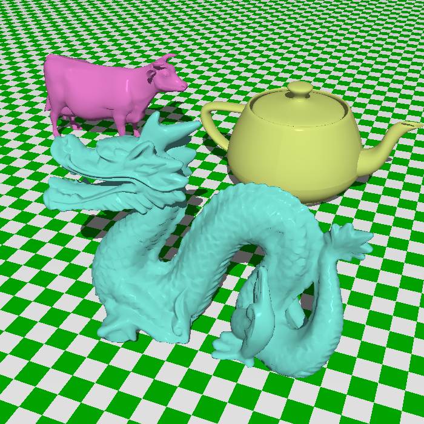
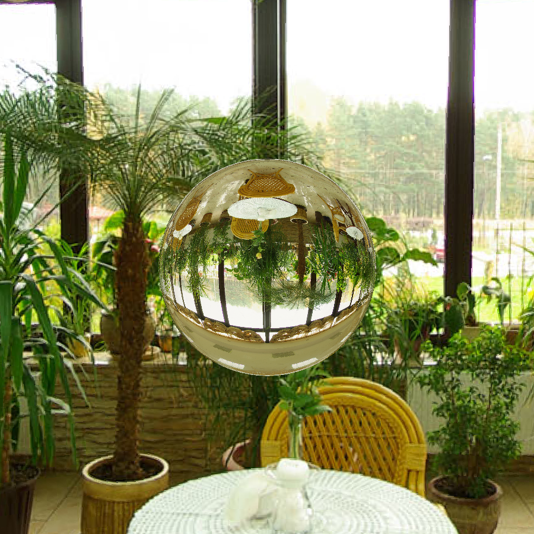

# SoulRay

SoulRay is a Cpu Ray Tracer written in C++ inspired by The Ray Tracer Challenge.

I started this project to learn about how ray tracing works and how scenes are rendered in 3D.
Also to get more experience working with C++.
Features were added as i learnt more things so the code isn't very good or optimal and has room
for lots of improvement.

---

## Currently Supports:

- Only Direct Light Contribution
- Single Point Light as the light source 
- Reflection, Refraction and the Fresnel Effect using Schlick approximation
- Phong Lighting
- Loading and Rendering 3D models (.OBJ files)
- Generating weighted vertex normals for OBJ models if not provided already
- Speeding up the rendering process with BVH (Bounding Volume Heirarchy) acceleration structure
- Outputs the rendered image in a .ppm file format
- Spherical Environment Mapping
- Supports Loading Background Images in .ppm format
- No user interface or cli

---

## Renders

 

700 x 700 pixels image rendered in 37.501 secs.. 

#### Spherical Environment Mapped background images
Glass Sphere

Metal Dragon and a teapot 

1500 x 1500 pixels image rendered in 245.797 secs

---

## TODO

- Add SDL2 for image viewing and possibly simple animations in future
- Add Anti-aliasing
- Matrix implementation, currently uses vectors 
- Add CLI and improve code 
- Add Soft Shadows
- Add Indirect Lighting 
- Add Texture Mapping and .mtl file reading
- Add Multithreading for faster renders
- Add support for reading and writing binary .ppm files, currently writes to ASCII .ppm files
- Add support for loading png images
- Add some kind of Render logging system to save scene and performance related data.

---